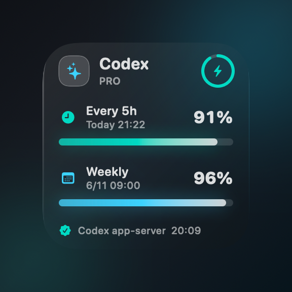
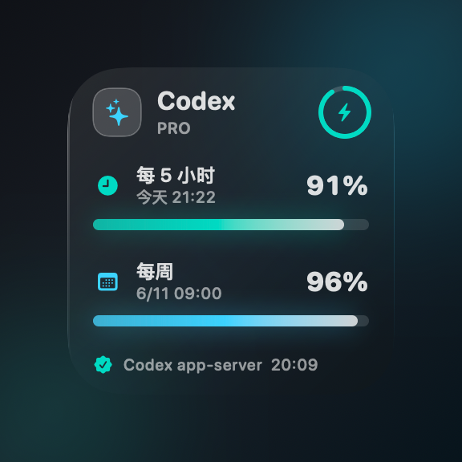

# QuotaHalo

一个 macOS 透明玻璃桌面小组件，用来查看 Codex 用量余量。

它会显示 Codex 本地 app-server 返回的两个窗口：

- 每 5 小时余量和重置时间
- 每周余量和重置时间

这个项目不实现自己的 OpenAI 登录，不保存 token，也不直接请求 OpenAI API。它只会启动本机已安装的 `codex`，通过 `codex app-server --stdio` 读取 `account/rateLimits/read`。

> 非官方项目，与 OpenAI 无隶属关系。

## 预览

| English | 中文 |
| --- | --- |
|  |  |

## 图标说明

| 图标 | English UI | 中文 UI | 含义 |
| --- | --- | --- | --- |
| `sparkles` | Codex | Codex | 产品/应用标识 |
| `clock.fill` | Every 5h | 每 5 小时 | Codex 每 5 小时窗口 |
| `calendar` | Weekly | 每周 | Codex 每周窗口 |
| `bolt.fill` | Status ring | 状态环 | 快速状态提示 |
| `checkmark.seal.fill` | Codex app-server | Codex app-server | 已成功读取配额 |

## 要求

- macOS 13 或更高
- 本机已安装 Codex
- Codex 已使用 ChatGPT 登录

只有从源码构建时才需要 Apple Command Line Tools 或 Xcode。

## 不用命令安装

普通用户推荐走 GitHub Releases：

1. 下载 `QuotaHalo.app.zip`。
2. 解压。
3. 把 `QuotaHalo.app` 拖进 `Applications`。
4. 双击打开。
5. 如果无法读取配额，从菜单栏打开 `Setup...`。

这条 release 安装路径不需要用户输入 Terminal 命令。

如果 macOS 因为未签名阻止首次打开，可以右键 app 选择 `Open`。正式发布时维护者最好做签名和 notarization。

## 不用手敲命令登录

应用仍然使用官方 Codex 登录，但用户不需要自己输入命令：

1. 打开菜单栏图标。
2. 选择 `Setup...`。
3. 点击 `Open Codex App` 或 `Start Codex Login`。
4. 完成官方 Codex 登录流程。
5. 点击 `Refresh Quota`。

`Start Codex Login` 会打开一个小 Terminal 窗口，替用户运行官方 `codex login`。本应用不会索要、保存或打印 token。

检查登录状态：

```bash
codex login status
```

如果还没登录：

```bash
codex login
```

读取配额建议使用 ChatGPT 登录。仅 API key 登录可能无法返回 ChatGPT/Codex 账号用量限制。

## 使用步骤

1. 克隆项目：

```bash
git clone https://github.com/BeyonderXX/QuotaHalo.git
cd QuotaHalo
```

2. 确认 Codex 已安装并登录：

```bash
command -v codex
codex login status
```

3. 从源码运行：

```bash
swift run QuotaHalo
```

4. 打印标准化后的余量数据：

```bash
swift run QuotaHalo --print-quota
```

5. 打包 `.app`：

```bash
scripts/build-app.sh
```

打包结果在：

```text
dist/QuotaHalo.app
```

6. 打开应用：

```bash
open dist/QuotaHalo.app
```

7. 可选：安装为登录启动项：

```bash
scripts/install-launch-agent.sh
```

## 语言

默认语言：English。

支持：

- English
- 中文

从菜单栏选择：

```text
Language -> English / 中文
```

语言选择会写入 macOS `UserDefaults`。

## 认证说明

这个应用不处理 OpenAI token。认证流程是：

1. 你通过 `codex login` 登录。
2. Codex 将凭据保存在它自己的受支持位置。
3. QuotaHalo 启动 `codex app-server --stdio`。
4. app-server 通过 `account/rateLimits/read` 返回脱敏后的配额快照。

更多细节见 [docs/AUTHENTICATION.md](docs/AUTHENTICATION.md)。

## 手动 JSON 回退

如果 Codex 未登录、不可用，或 app-server 协议发生变化，小组件会回退读取：

```text
~/Library/Application Support/QuotaHalo/usage.json
```

菜单栏里选择：

```text
Open Manual JSON
```

示例：

```json
{
  "fiveHour": {
    "remainingPercent": 72,
    "resetAt": "2026-06-06T00:00:00+08:00"
  },
  "weekly": {
    "remainingPercent": 91,
    "resetAt": "2026-06-11T09:00:00+08:00"
  },
  "limitName": "Codex",
  "planType": "pro",
  "source": "manual usage.json"
}
```

## 许可证

MIT。见 [LICENSE](LICENSE)。
